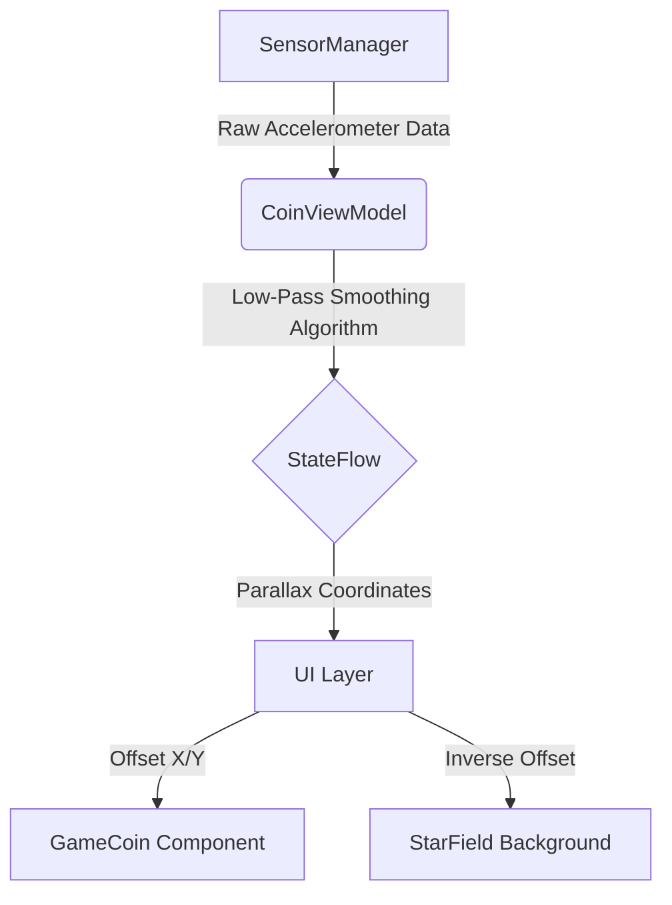

<div align="center">

# FairFlip 🪙

### **The World's Most "Honest" Coin Flip Application.**
  


<a href="https://github.com/SilentFURY-x/FairFlip-Cheating-Coin-Toss-App/releases/download/v1.0.0/FairFlip-v1.0.0.apk">
  
</a>

<br /> <br />
*A production-grade coin toss application featuring sensor-fusion parallax, procedural graphics, and a hidden algorithmic engine.*

[Key Features](#-key-features) • [Physics Engine](#physics) • [Installation](#setup)

</div>

---

## 🚀 Overview

**FairFlip** is a study in **deceptive UI design**. On the surface, it is a polished, beautiful coin toss application compliant with Material 3 standards. Under the hood, it utilizes the device's **accelerometer** and **haptic engine** to allow the owner to rig the outcome of the flip without touching the screen.

Built entirely in **Jetpack Compose** with a **Clean MVVM Architecture**, it demonstrates how raw sensor data can be transformed into fluid, interactive animations.

---

## ✨ Key Features

### 🎨 Visuals & Immersion
* **Hyper-Reactive Parallax:** The coin and the background star field move independently based on device tilt.
* **Procedural Star Field:** A custom Canvas component generates 120 unique stars with randomized alpha and scale, optimized to render without recomposition overhead.
* **Edge-to-Edge Design:** Fully immersive UI that draws behind system bars with a custom radial gradient spotlight.
* **True 3D Rotation:** No image swapping—the coin is a 3D object that physically rotates 180° to reveal the result.

### 🕵️‍♂️ The "Stealth" Mechanics
* **Magician Mode:** A hidden long-press gesture on the app title toggles "Stealth Mode."
* **Gyroscopic Rigging:**
    * *Tilt Left (>5°):* Result forced to **Heads**.
    * *Tilt Right (<-5°):* Result forced to **Tails**.
    * *Hold Flat:* Result uses `Random.nextBoolean()` (True Fair Mode).
* **Tactile Confirmation:**
    * **Heads:** Single sharp tick (100ms @ Max Amplitude).
    * **Tails:** Heavy double rumble (Waveform pattern).
    * *Note:* The user feels the result *before* the coin flips, allowing for a convincing performance.
 
---

<a id="physics"></a>
## ⚛️ Physics & Parallax Engine

FairFlip uses a custom low-pass filter to manage sensor noise, ensuring animations are responsive but smooth.

### The Algorithm
* Raw sensor data is noisy. We apply a weighted smoothing function to create a snappy, responsive feel (`0.4f` alpha):

  ```kotlin
  // CoinViewModel.kt
  // Alpha 0.4f provides high responsiveness while filtering micro-tremors
  smoothedX += (targetX - smoothedX) * 0.4f
  ```
### Deep Inverse Parallax
* To create a "Deep Space" illusion, the foreground and background layers move in opposition:
  | Layer | Multiplier | Direction | Effect |
  | :--- | :--- | :--- | :--- |
  | **Foreground (Coin)** | `2.0f` | **With Gravity** | Slides physically towards the tilt. |
  | **Background (Stars)** | `2.0f` | **Against Gravity** | Moves equally fast in reverse, simulating extreme depth. |

---

## 🛠 Tech Stack
* Language: Kotlin

* UI Toolkit: Jetpack Compose (Material 3)

* Architecture: MVVM (Model-View-ViewModel)

* Asynchronous: Kotlin Coroutines & StateFlow

* Sensors: SensorManager (Accelerometer)

* Haptics: VibratorManager with fallback support for older SDKs.

---

## 📱 Architecture

The app follows a strict **Clean Architecture** approach to separate the physics engine from the rendering layer.


## 📸 Screen Showcase

<div align = "center">
  
| The Stage | Stealth Mode | Parallax |
| :---: | :---: | :---: |
|  |  |  |
| *Immersive Gradient & 3D Coin* | *Hidden Activation Toast* | *Parallax* |

</div>

---

<a id="setup"></a>
## ⚡ Setup & Installation
**Download the App:**
* Click below to download the latest stable version (v1.0.0) for your Android device:
* 👉 **[Download FairFlip-v1.0.0.apk](https://github.com/SilentFURY-x/FairFlip-Cheating-Coin-Toss-App/releases/download/v1.0.0/FairFlip-v1.0.0.apk)**
    
**OR**

1.  **Clone the repository:**
    ```bash
        git clone https://github.com/SilentFURY-x/FairFlip-Cheating-Coin-Toss-App.git
    ```
2.  **Open in Android Studio:**
     * Ensure you are using the latest version (Ladybug or newer).
3.  **Permissions:**
     * The app requires android.permission.VIBRATE (automatically handled in Manifest).

4.  **Build & Run:**
     * Run on a physical device (Emulators do not support accelerometer tilting correctly).

---

## 🤝 Contributing

Contributions are what make the open-source community such an amazing place to learn, inspire, and create. Any contributions you make are **greatly appreciated**.
1.  **Fork the Project**
2.  **Create your Feature Branch:**

      ```bash
      git checkout -b feature/AmazingFeature
      ```
4.  **Commit your Changes:**

      ```bash
      git commit -m 'Add some AmazingFeature'
      ```
6.  **Push to the Branch:**
      ```bash
      git push origin feature/AmazingFeature
      ```
7.  **Open a Pull Request**

---

## 📄 License

Distributed under the MIT License. See `LICENSE` for more information.

---

## 👨‍💻 Author
<div align="center">

**Arjun Tyagi**

[](https://github.com/SilentFURY-x)
[](https://www.linkedin.com/in/arjun-tyagi-84b1b5328/)

</div>

---

<p align="center">
  <i>Built with ❤️, Logic, and Deception by <b>Arjun Tyagi</b></i>
</p>
